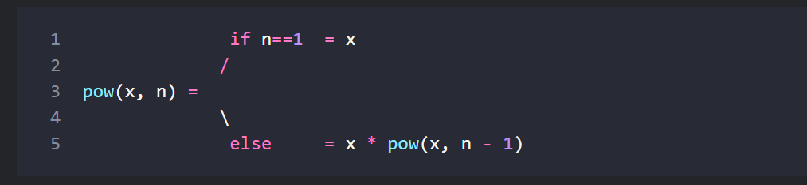
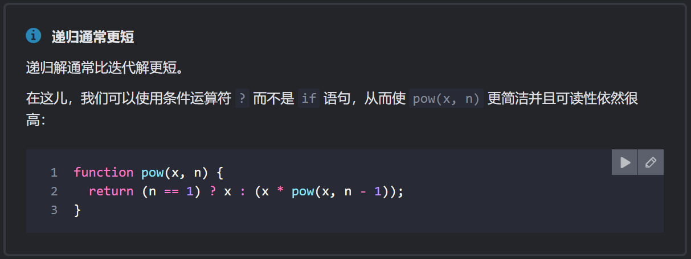
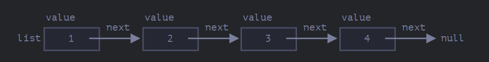

# 递归和堆桟

## 递归

递归是一种编程模式，在一个任务可以自然地拆分成多个相同类型但更简单的任务的情况下非常有用。或者，在一个任务可以简化为一个简单的行为加上该任务的一个更简单的变体的时候可以使用。或者，处理那些由许多相同子结构组成的数据结构。

一个函数在函数体内调用自己的行为就是所谓的 **递归**。


递归的第一好处：简化思维，递归将任务划分为不同的分支，并逐渐将复杂的任务简化




递归的其它好处：简洁，如果分支数不多且任务简单，我们可以使用条件运算符让他更短




### 最大递归深度

最大的嵌套调用次数（包括首次）被称为 **递归深度**。在上述例子中，它正好等于 `n`。

最大递归深度受限于 JavaScript 引擎。对我们来说，引擎在最大迭代深度为 10000 及以下时是可靠的，有些引擎可能允许更大的最大深度，但是对于大多数引擎来说，100000 可能就超出限制了。有一些自动优化能够帮助减轻这种情况（尾部调用优化），但目前它们还没有被完全支持，只能用于简单场景。


### [执行上下文与堆桟](https://zh.javascript.info/recursion#zhi-hang-shang-xia-wen-he-dui-zhan "执行上下文与堆桟")

[执行上下文](https://tc39.github.io/ecma262/#sec-execution-contexts "执行上下文")（execution context） 是一个内部数据结构，它包含有关函数执行时的详细细节：当前控制流所在的位置，当前的变量，`this` 的值（此处我们不使用它），以及其它的一些内部细节。

一个函数调用仅具有一个与其相关联的执行上下文。

当一个函数进行嵌套调用时，将发生以下的事儿：

-   当前函数被暂停；
-   与它关联的执行上下文被一个叫做 **执行上下文堆栈** 的特殊数据结构保存；
-   执行嵌套调用；
-   嵌套调用结束后，从堆栈中恢复之前的执行上下文，并从停止的位置恢复外部函数


### [递归结构 - 链表](https://zh.javascript.info/recursion#lian-biao "递归结构 - 链表")

**链表元素** 是一个使用以下元素通过递归定义的对象：

-   `value`。
-   `next` 属性引用下一个 **链表元素** 或者代表末尾的 `null`。

例如：

```javascript
let list = {
  value: 1,
  next: {
    value: 2,
    next: {
      value: 3,
      next: {
        value: 4,
        next: null
      }
    }
  }
};
```


