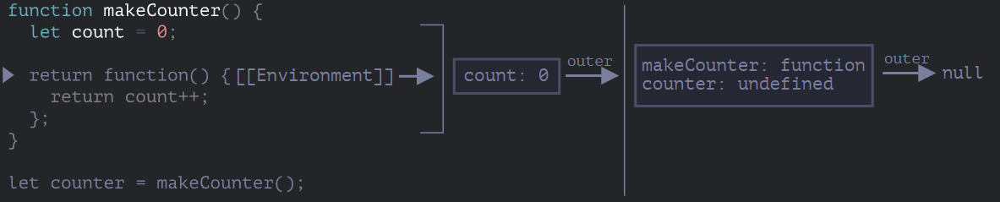
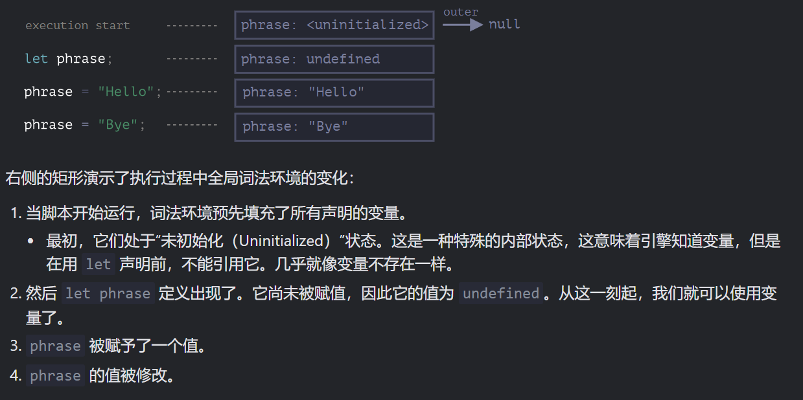

# 变量作用域与闭包

> [闭包部分建议配合mdn观看](https://developer.mozilla.org/zh-CN/docs/Web/JavaScript/Closures "闭包部分建议配合mdn观看")

## 变量作用域

var将变量作用域划分为全局作用域和函数作用域

ES6的let和const引入块作用域

关于作用域咱就不多哔哔了 详情戳→[数据类型与变量](https://www.wolai.com/9vWWgtLhEdEg5rtN2QrDAc#3gvd6ppeGaGnY37CzC3YFX "数据类型与变量")

值得一提的是，function声明的函数也是分作用域的

```javascript
"use strict"; 
//严格模式将严格采用es6语法，不开严格模式则该函数会正常运行，因为浏览器为了兼容以前的老代码，有自己的方式
//详见 https://blog.csdn.net/TalonZhang/article/details/85015489
//实际上，考虑到环境导致的行为差异太大，应该避免在块级作用域内声明函数。如果确实需要，也应该写成函数表达式，而不是函数声明语句

let phrase = "Hello";

if (true) {
  let user = "John";

  function sayHi() {
    alert(`${phrase}, ${user}`);
  }
}

sayHi();
```

该代码执行的效果是 ERROR，因为

> 函数 `sayHi` 是在 `if` 内声明的，所以它只存在于 `if` 中。外部是没有 `sayHi` 的。


## 闭包

### 概念

一个函数和对其周围状态（**lexical environment，词法环境**）的引用捆绑在一起（或者说函数被引用包围），这样的组合就是**闭包**（**closure**）

也就是说，闭包让你可以在一个内层函数中访问到其外层函数的作用域。在 JavaScript 中，每当创建一个函数，闭包就会在函数创建的同时被创建出来。

其原理是：JavaScript 中的函数会自动通过隐藏的 `[[Environment]]` 属性记住创建它们的位置，所以它们都可以访问外部变量。

在面试时，前端开发者通常会被问到“什么是闭包？”，正确的回答应该是闭包的定义，并解释清楚为什么 JavaScript 中的所有函数都是闭包的，以及可能的关于 `[[Environment]]` 属性和词法环境原理的技术细节。

***

### 原理

-   [词法环境 lexical environment](https://zh.javascript.info/closure#ci-fa-huan-jing "词法环境 lexical environment")

    在 JavaScript 中，每个运行的函数，代码块 `{...}` 以及整个脚本，都有一个被称为 **词法环境（Lexical Environment）** 的内部（隐藏）的关联对象。

    词法环境对象由两部分组成：
    1.  **环境记录（Environment Record）** —— 一个存储所有局部变量作为其属性（包括一些其他信息，例如 `this` 的值）的对象。
    2.  对 **外部词法环境** 的引用，与外部代码相关联。
    所有的函数在“诞生”时都会记住创建它们的[词法环境](https://zh.javascript.info/closure#ci-fa-huan-jing "词法环境")。从技术上讲，这里没有什么魔法：所有函数都有名为 `[[Environment]]` 的隐藏属性，该属性保存了对创建该函数的词法环境的引用。

    
    ***
    词法环境对变量的初始化

    

    这里有陷阱，示例
    ```javascript
    let x = 1;

    function func() {
      console.log(x); // ?

      let x = 2;
    }

    func(); //ReferenceError: Cannot access 'x' before initialization
    ```
    虽然let不会被变量提升，但引擎在该作用域中监测到了所有声明的变量，在正式运行到声明前，这些变量是不可用的，也不会去引用外部词法环境，这样避免了一些错误（如果能引用外部变量）

    变量暂时无法使用的区域（从代码块的开始到 `let`）有时被称为“死区”
-   [垃圾回收](https://zh.javascript.info/closure#la-ji-shou-ji "垃圾回收")

    我们知道js中不可达的变量会被回收内存地址，而在闭包中即使外部函数执行结束，运行嵌套函数时你仍可以获取到外部函数执行时的变量值，且该变量值不会被初始化，这代表着外部函数因为嵌套函数可达而变得可达，并没有被回收内存地址
    ```javascript
    function f() {
      let value = 123;

      return function() {
        alert(value);
      }
    }

    let g = f(); // g.[[Environment]] 存储了对相应 f() 调用的词法环境的引用
    ```
    当词法环境对象变得不可达时，它就会死去（就像其他任何对象一样）。换句话说，它仅在至少有一个嵌套函数引用它时才存在。

    在下面的代码中，嵌套函数被删除后，其封闭的词法环境（以及其中的 `value`）也会被从内存中删除：
    ```javascript
    function f() {
      let value = 123;

      return function() {
        alert(value);
      }
    }

    let g = f(); // 当 g 函数存在时，该值会被保留在内存中

    g = null; // ……现在内存被清理了
    ```


### 为什么使用闭包 - 核心作用（可能不完善）

考虑一个调用计数器，记录函数调用的累积次数

通常，我们会这样写

```javascript
let count = { value: 0 };

function counter(count) {
  count.value++;
}
function foo() {
  //....
  counter(count);
}

foo();
console.log(count); //1
foo();
console.log(count); //2
```

可以看到我们在上文中声明了一个记录次数的对象count，类型为对象是为了保留在函数内的改动，基础类型的变量是不行的，因为作为参数传入时传入的只是值

对象的引入特点是一把双刃剑，将对象暴露在外部也是十分危险的，可以被其它代码轻易改动，十分耦合

为此，将count和该函数包裹起来，是一个好方法

```javascript
function counter_old() {
  let count = 0;
  return function () {
    console.log(count++);
  };
}

let counter = counter_old();

function foo() {
  //....
  counter();
}

foo(); //0
foo(); //1
```

可以看到，因为内部函数引用了外部函数的变量，他们之间也有了联系，且作为内部函数的外部词法环境，外部变量的变动是会被保存的，不再仅限于对象类型

这里还有一个问题，为什么要把数据抽离放在外部，直接返回一个带数据的函数可以吗

```javascript
function counter_old() {
  return function () {
    let count = 0;
    console.log(count++);
  };
}

let counter = counter_old();

function foo() {
  //....
  counter();
}

foo(); //0
foo(); //0
```

可以看到这样做的结果是，count不再具有存储变动的功能，因为每次调用counter都是一次全新的

相同函数的不同调用会创造独立、初始的词法环境，只有当你保存了某次调用时，他才能不被gc，从而保存上一次执行的上下文

```javascript
function f() {
  let value = 1;

  return function () {
    console.log(value++);
  };
}
f()(); //1
f()();//1
let g = f();
g();//1
g();//2
```

综上所述，闭包为一个函数绑定了一个不变的外部词法环境（即将内部函数进行保存后（赋值），他内部的environment属性会一直保存创建时外部词法环境的地址，达到存储改动的效果），而每次调用外部函数也会返回一个全新的闭包，这和面向对象中的类与实例有着异曲同工之妙

***

> 🎍扩展 - 把闭包玩出花样

### [闭包的常见用途](https://developer.mozilla.org/zh-CN/docs/Web/JavaScript/Closures#practical_closures "闭包的常见用途")

闭包很有用，因为它允许将函数与其所操作的某些数据（环境）关联起来。这显然类似于面向对象编程。在面向对象编程中，对象允许我们将某些数据（对象的属性）与一个或者多个方法相关联。

因此，通常你使用只有一个方法的对象的地方，都可以使用闭包。

在 Web 中，你想要这样做的情况特别常见。大部分我们所写的 JavaScript 代码都是基于事件的 — 定义某种行为，然后将其添加到用户触发的事件之上（比如点击或者按键）。我们的代码通常作为回调：为响应事件而执行的函数。

### [用闭包模拟私有化](https://developer.mozilla.org/zh-CN/docs/Web/JavaScript/Closures#emulating_private_methods_with_closures "用闭包模拟私有化")

### 实际开发中对闭包的优化

正如我们所看到的，理论上当函数可达时，它外部的所有变量也都将存在。

但在实际中，JavaScript 引擎会试图优化它。它们会分析变量的使用情况，如果从代码中可以明显看出有未使用的外部变量，那么就会将其删除。

**在 V8（Chrome，Edge，Opera）中的一个重要的副作用是，此类变量在调试中将不可用。**

```javascript
function f() {
  let value = Math.random();

  function g() {
    debugger; // 在 Console 中：输入 alert(value); No such variable!
  }

  return g;
}

let g = f();
g();
```

而当外部恰巧有同名变量，而你不知道v8引擎的这一特性时，你会意外地获取到外部同名变量的值


## fabulous practice

<https://zh.javascript.info/closure#han-shu-da-jun>

最后一题以词法环境的原理剖析了bug，让我对lexiel environment 的理解和掌握更深了

第一次做时，我的答案是

```javascript
function makeArmy() {
  let shooters = [];
  let i = 0;
  while (i < 10) {
    let shooter = createArmy(i);
    shooters.push(shooter);
    i++;
  }
  return shooters;

  function createArmy(i) {
    return function () {
      console.log(i);
    };
  }
}
```

那时我对闭包和词法环境的理解仅仅停在表面，只知道闭包的每一次调用返回一个新的函数，甚至忘记了函数表达式内存储的都只是函数代码，这和真相相距甚远

以此，我认识到了我在学习中对实践的匮乏，将导致我对理论的掌握永远流于表面

