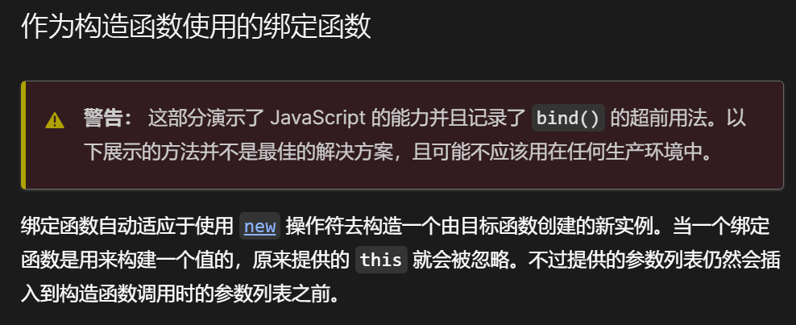

# 面试题手写bind，原来没有我想得那么简单

> ☣️导语：bind不仅是绑定上下文和默认参数，还需要应对一些如new调用这样的特殊场景，需要在内部判断调用环境改变上下文并设置原型

先来简单回顾一下`bind`是干啥的：

> `bind` - 返回绑定上下文和参数的新函数，可用于生产偏函数

> 语法：`let bound = func.bind(context, [arg1], [arg2], ...);`

我马上懂了，这不就是用`apply`构建的语法糖，而`bind`的作用就是让你不用每次都写apply去绑定上下文和默认参数

唉╮(╯▽╰)╭，今天的手写代码每日一题又结束了

吭吭施工：

```javascript
Function.prototype.myBind = function (context, ...args) {
  if (typeof this !== "function") {
    throw new TypeError("The binding object must be a function");
  }
  const originFunc = this; // (*)
  return function () {
    return originFunc.apply(context,[...args, ...arguments]); 
  };
};
```

浅注意一下在`(*)`处要保存一下this，不能直接在返回的函数里写this，因为返回函数中this的值是该函数调用的时候才决定的

OK，大功告成，出于严谨，看看别人写的（其实也没什么好看的对吧）

```javascript
// bind 函数实现
Function.prototype.myBind = function(context) {
  // 判断调用对象是否为函数
  if (typeof this !== "function") {
    throw new TypeError("Error");
  }
  // 获取参数
  var args = [...arguments].slice(1),
      fn = this;
  return function Fn() {
    // 根据调用方式，传入不同绑定值
    return fn.apply(
      this instanceof Fn ? this : context, // (*)
      args.concat(...arguments)
    );
  };
};
```

谢！`(*)`是啥？为嘛要整个这？

遇事不觉，[MDN里学！](https://developer.mozilla.org/zh-CN/docs/Web/JavaScript/Reference/Global_Objects/Function/bind#%E4%BD%9C%E4%B8%BA%E6%9E%84%E9%80%A0%E5%87%BD%E6%95%B0%E4%BD%BF%E7%94%A8%E7%9A%84%E7%BB%91%E5%AE%9A%E5%87%BD%E6%95%B0 "MDN里学！")



哦哦！是new，当我们用new调用绑定函数时...我自己也有点迷糊了w(ﾟДﾟ)w

自己整个例子测测，哼

```javascript
function Rabbit(name) {
  this.name = name;
}

const fake = {};

// myBind
let Rabbit_lee = Rabbit.myBind(fake, "lee");
let rab = new Rabbit_lee();

console.log(fake); //  { name: 'lee' }
console.log(rab); // {}
console.log(rab instanceof Rabbit); // false

// bind
Rabbit_lee = Rabbit.bind(fake, "lee");
rab = new Rabbit_lee();

console.log(fake); // {}
console.log(rab); // Rabbit { name: 'lee' }
console.log(rab instanceof Rabbit); // true

```

如上，JS的bind希望的是使用new调用时，原先绑定的上下文被忽略，而只使用绑定的默认参数

回顾一下，`new`关键字会进行如下操作：

1.  创建一个空的简单`JavaScript`对象(即`{}`)
2.  将这个空对象的原型指向构造函数的`prototype`属性
3.  将步骤1新创建的对象作为`this`的上下文
4.  执行构造函数内部的代码
5.  如果该函数没有返回对象，则返回`this`

所以说，针对这个特殊调用场景，我们要能自动改变绑定的上下文，来吧

因此，我们需要判断绑定函数`bound`是否在被`new`调用

因为`new`会先将`this`的原型指向构造函数的原型，所以此时的`this`是可以使用`instanceof`来判断是不是`new`新创造的实例的

那么代码来咯

```javascript
Function.prototype.myBind = function (context, ...args) {
  if (typeof this !== "function") {
    throw new TypeError("The binding object must be a function");
  }
  const originFunc = this;
  function bound() {
    return originFunc.apply(this instanceof bound ? this : context, [
      ...args,
      ...arguments,
    ]);
  }
  bound.prototype = Object.create(originFunc.prototype); // (*)
  return bound;
};

```

需要注意的是在`(*)`，为了完整性，使实例可以用`instanceof`判断原型，我们也要为`bound`设置原型，因为他才是真的构造函数呀（有点隔壁老王的意思O(∩\_∩)O\~）

