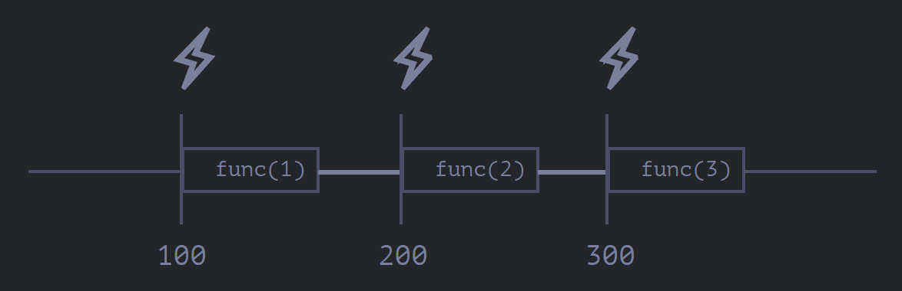
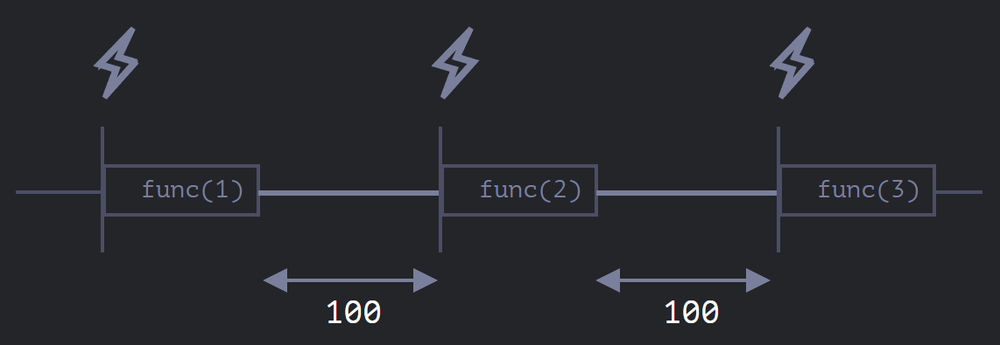

# 调度程序：setTimeout与setInterval

-   `setTimeout` 允许我们将函数推迟到一段时间间隔之后再执行。
-   `setInterval` 允许我们重复运行一个函数，从一段时间间隔之后开始运行，之后以该时间间隔连续重复运行该函数。

这两个方法并非js的规范，但在所有浏览器和node.js中都支持（行为会有些许不同）

## setTimeout

`let timerId = setTimeout(func|code, [delay], [arg1], [arg2], ...)`

-   arg为传入func的参数，支持字符串code创建函数（历史原因存在，不建议使用）
-   timerId - 定时器标识符（timer identifier），在node.js中为一个定时器对象，在浏览器中是一个数字，用于传入clearTimeout以取消调度

### 嵌套setTimeout

-   基本用法，在回调函数中再次执行自身，相当于setInterval
-   可以根据当前执行结果来动态调整下一次调度

    例如，我们要实现一个服务（server），每间隔 5 秒向服务器发送一个数据请求，但如果服务器过载了，那么就要降低请求频率，比如将间隔增加到 10、20、40 秒等。
    ```javascript
    let delay = 5000;

    let timerId = setTimeout(function request() {
      ...发送请求...

      if (request failed due to server overload) {
        // 下一次执行的间隔是当前的 2 倍
        delay *= 2;
      }

      timerId = setTimeout(request, delay);

    }, delay);
    ```
-   比之**`setInterval`**** 能够更精确地设置两次执行之间的延时，**因为是上一次执行完再开始计时，而非在执行开始时就开始重新计时

### 零延时setTimeout

`setTimeout(func, 0)`，或者仅仅是 `setTimeout(func)`，该函数将在当前脚本执行完成“之后”立即执行

> 🎷理论上的零延时在现实中并不存在，参见 [零延时实际上不为零（在浏览器中）](https://zh.javascript.info/settimeout-setinterval#ling-yan-shi-de-settimeout "零延时实际上不为零（在浏览器中）")

## setInterval

`let timerId = setInterval(func|code, [delay], [arg1], [arg2], ...)`

-   delay后再执行


## 两者的不同

就两次执行的时间间隔来说，`setInterval`实际上是小于`delay`的





## 两者相同点

-   调度器运行时机
    -   异步操作，都会等主线程代码执行完
-   垃圾回收
    -   当一个函数传入 `setInterval/setTimeout` 时，将为其创建一个内部引用，并保存在调度程序中。这样，即使这个函数没有其他引用，也能防止垃圾回收器（GC）将其回收。
    -   对于 `setInterval`，传入的函数也是一直存在于内存中，直到 `clearInterval` 被调用。
    -   这里还要提到一个副作用。如果函数引用了外部变量（译注：闭包），那么只要这个函数还存在，外部变量也会随之存在。它们可能比函数本身占用更多的内存。因此，当我们不再需要调度函数时，最好取消它，即使这是个（占用内存）很小的函数。

## 限制

请注意，所有的调度方法都不能 **保证** 确切的延时。

例如，浏览器内的计时器可能由于许多原因而变慢：

-   CPU 过载。
-   浏览器页签处于后台模式。
-   笔记本电脑用的是省电模式。

所有这些因素，可能会将定时器的最小计时器分辨率（最小延迟）增加到 300ms 甚至 1000ms，具体以浏览器及其设置为准。

