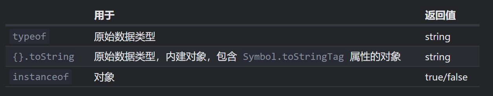

# 还在用typeof、instanceof？是时候给你的类型检查升个级了

🎲传统的这两种类型检查方法存在适用范围窄、历史遗留bug等问题，虽在功能上可以互补，但使用起来也十分繁琐，今天让俺带你了解的一种更强大的类型判断方法，不仅可以一次性替代这两种方法，还支持更高级的自定义功能

***

## typeof 与 instanceof

知己知彼，百战不殆，只有了解了旧方法的局限性，我们才能对新方法的方便之处记忆深刻

现在我们来浅浅回顾一下

### typeof

`typeof` 是一个操作符，不是一个函数，语法有两种： `typeof x` 与 `typeof(x)`，返回一个string，他的抽象层较高，适合对原始类型进行快速判断，但由于历史原因，有一些奇怪的"bug"

```javascript
typeof undefined // "undefined"

typeof 0 // "number"

typeof 10n // "bigint"

typeof true // "boolean"

typeof "foo" // "string"

typeof Symbol("id") // "symbol"

typeof {} // "object"  

typeof [] // "object"  

typeof Math // "object"  (1)

typeof null // "object"  (2)

typeof alert // "function"  (3)
```

最后三行可能需要额外的说明，这也是我们使用`typeof`常常会出现的疑惑

1.  `Math` 是一个提供数学运算的内建 `object`，和`Array`一样，`typeof`不能对`Object`类型的继承类型进行区分，而稍后我们介绍的方法会比这个结果更加细致
2.  `typeof null` 的结果为 `"object"`。这是官方承认的 `typeof` 的错误，这个问题来自于 JavaScript 语言的早期阶段，并为了兼容性而保留了下来。`null` 绝对不是一个 `object`。`null` 有自己的类型，它是一个特殊值。`typeof` 的行为在这里是错误的。
3.  `typeof alert` 的结果是 `"function"`，因为 `alert` 在 JavaScript 语言中是一个函数。在 JavaScript 语言中没有一个特别的 “function” 类型。函数隶属于 `object` 类型。但是 `typeof` 会对函数区分对待，并返回 `"function"`。这也是来自于 JavaScript 语言早期的问题。从技术上讲，这种行为是不正确的，但在实际编程中却非常方便。

### instanceof

`obj instanceof Class`，检查实例化对象是否属于该类或该类的衍生类，返回`boolean`，原理是检查 `Class.prototype` 是否在 `obj` 的原型链之中

换句话说，即`instanceof`判断这个对象是否创建于该类或该类的父类

```javascript
1 instanceof Number; // false

true instanceof Boolean; // false

"str" instanceof String; // false

[] instanceof Array; // true

function(){} instanceof Function; // true

{} instanceof Object; // true

```

可以看到，它弥补上文提到的typeof的缺点的第一条，即对于对象的继承类的判断，如`Array`，`Function`

但它的缺陷也很明显，只适用于判断对象，不能判断原始类型就算了，还给我报false（哪怕给个报错都行啊），而且不是我每次判断的时候都知道他可能是什么类型，我想让你直接告诉我，别卖关子了😭

还有一点，因为`Class` 的 constructor 自身是不参与检查的！检查过程只和原型链以及 `Class.prototype` 有关。

创建对象后，如果更改 `prototype` 属性，可能会导致有趣的结果。

```javascript
function A() {}
function B() {}

A.prototype = B.prototype = {};

let a = new A();

alert( a instanceof B ); // true ,instanceof不再按套路出牌
```

## 升级 Object.prototype.toString

基于对上述两种类型判断方法的缺点及原因分析，我们针对痛点，挖掘js的潜能，可以推出更高级的方案

大家都知道，一个普通对象被转化为字符串时为 `[object Object]`：

```javascript
let obj = {};

alert(obj); // [object Object]
alert(obj.toString()); // 同上
```

这是通过 `toString` 方法实现的。但是这儿有一个隐藏的功能，该功能可以使 `toString` 实际上比这更强大。我们可以将其作为 `typeof` 的增强版或者 `instanceof` 的替代方法来使用。

按照 [规范](https://tc39.github.io/ecma262/#sec-object.prototype.tostring "规范") 所讲，内建的 `toString` 方法可以被从对象中提取出来，并在任何其他值的上下文中执行。其结果取决于该值。

-   对于 number 类型，结果是 `[object Number]`
-   对于 boolean 类型，结果是 `[object Boolean]`
-   对于 `null`：`[object Null]`
-   对于 `undefined`：`[object Undefined]`
-   对于数组：`[object Array]`
-   ……等（可自定义）

让我们演示一下：

```javascript
// 方便起见，将 toString 方法复制到一个变量中
let objectToString = Object.prototype.toString;

// 它是什么类型的？
let arr = [];

alert( objectToString.call(arr) ); // [object Array]
```

这里我们用到`Function`类型的内建函数`call`，他的第一个参数可以为调用的函数传入上下文，也就是this的值（这里this=arr），原上下文会被覆盖，因此我们相当于向`Object`借了一个工具，来帮我们给别的类型做事

在内部，`toString` 的算法会检查 `this`，并返回相应的结果。再举几个例子：

```javascript
let typeCheck = (val) => Object.prototype.toString.call(val);

console.log(typeCheck(123)); // [object Number]
console.log(typeCheck(null)); // [object Null]
console.log(typeCheck(undefined)); // [object Undefined]
console.log(typeCheck([])); // [object Array]
console.log(typeCheck(console.log)); // [object Function]

```

当当，解决了`typeof`不能判断`null`以及对象继承类（`Array`）的问题

到此，我们就完成了针对`typeof`的升级

“就这？”

当然不是！

### 判断信息自定义Symbol.toStringTag

toString的另一个强大之处在于可以使用特殊的对象属性 `Symbol.toStringTag` 自定义对象的 `toString` 方法的行为

例如

```javascript
let user = {
  [Symbol.toStringTag]: "User"
};

alert( {}.toString.call(user) ); // [object User]
```

对于大多数特定于环境的对象，都有一个这样的属性。下面是一些特定于浏览器的示例：

```javascript
// 特定于环境的对象和类的 toStringTag：
alert( window[Symbol.toStringTag]); // Window
alert( XMLHttpRequest.prototype[Symbol.toStringTag] ); // XMLHttpRequest

alert( {}.toString.call(window) ); // [object Window]
alert( {}.toString.call(new XMLHttpRequest()) ); // [object XMLHttpRequest]
```

正如我们所看到的，输出结果恰好是 `Symbol.toStringTag`（如果存在），只不过被包裹进了 `[object ...]` 里。

给大家举个在实际中使用的例子

有时我们对某个值进行类型判断，不是仅为了知道原型类的名字，根本上是为了知道这个类的定义以及作用

特别在自建类的使用中，定制化类型判断信息能极大减少我们的心智负担

```javascript
// 类声明文件
class User {}
User.prototype[Symbol.toStringTag] = "用于存储用户信息的对象";

// 类使用文件
let user = new User();

console.log({}.toString.call(user)); // [object 用于存储用户信息的对象]

```

在代码繁重的项目里，我们可以很清晰地立即了解这个对象的相关信息

### val.constructor

> 🐆还有一种类型判断方法，即查看该变量的constructor，这个方法也能判断原始类型和内置对象，但不支持null和undefined，且不支持自定义，完全在本方法的功能范围内，故不过多解释

## 总结



现在，我们手头上就有了个“磕了药似的 typeof”，不仅能检查原始数据类型，而且适用于内建对象，更可贵的是还支持自定义。

并且，如果我们想要获取内建对象的类型，并希望把该信息以字符串的形式返回，而不只是检查类型的话，我们也可以用 `{}.toString.call` 替代 `instanceof`。

