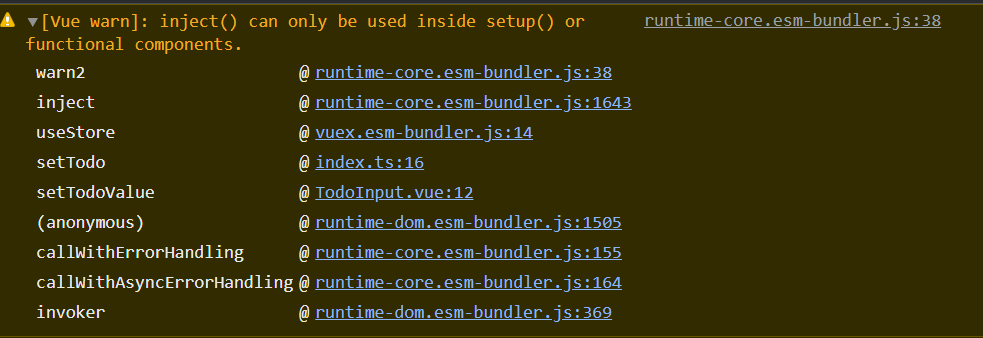

# vite+vuex4.x | hooks - useStore失效解决

今天遇到了个让人`?`的bug

## 需求情景

引入`vuex - store`，使用`store.dispatch`向`action`派发任务

```typescript
  //组ITodo，并dispatch给action
  function setTodo(todoValue: string): void {
    const store: Store<any> = useStore();

    const todo: ITodo = {
      id: new Date().getTime(),
      content: todoValue,
      status: "willdo",
    };

    store.dispatch(SET_TODO, todo);
  }
```

import

```typescript
import { Store, useStore } from "vuex";

```

## Error


很明显，此处的`store`获取失败

且warn提示`useStore`只能使用在`setup()`中，无语，该hooks正是引入组件`setup`中



## Solution

既然`useStore`不能给我带来新鲜的`store`，那我们就换个思路，自己去拿

修改`import`

```typescript
// import { Store, useStore } from "vuex";
import store from "../store/index"; //在实例中引入store才有效，上一行useStore无效，家人们感觉是vite构建的问题

```

此处使用`../store`也是可以的

`../store/index`:

```typescript
import { createStore } from "vuex";
import actions from "./actions";
import mutations from "./mutations";
import state from "./state";

export default createStore({
  state,
  mutations,
  actions,
});

```

这里的默认导出，实则可以写成

```typescript
export const store = createStore(...)
```

修改引入后的hooks中，我们直接使用`store`及其方法

```typescript
  function setTodo(todoValue: string): void {
    // const store: Store<any> = useStore();

    const todo: ITodo = {
      id: new Date().getTime(),
      content: todoValue,
      status: "willdo",
    };

    store.dispatch(SET_TODO, todo);
  }
```

warn和error消失


## 问题溯源

查阅网络 + 手动排除，几乎可确定为是`vite`的原因，该代码（报错版本）在`vue-cli + webpack`中可正常使用，具体原因，咱没查到，未来深究

## 扩展

`useStore`的作用

<https://vuex.vuejs.org/zh/guide/composition-api.html#组合式api>

`useStore`源码分析

```typescript
function useStore (key) {
    
  if ( key === void 0 ) key = null;

  // 直接通过key获取通过provide保存的store对象
  return inject(key !== null ? key : storeKey)
}
```

这也解释了为何我们在hooks中使用`useStore`时会报`inject`警告

